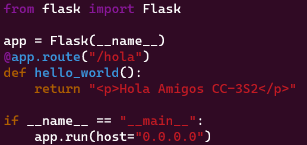
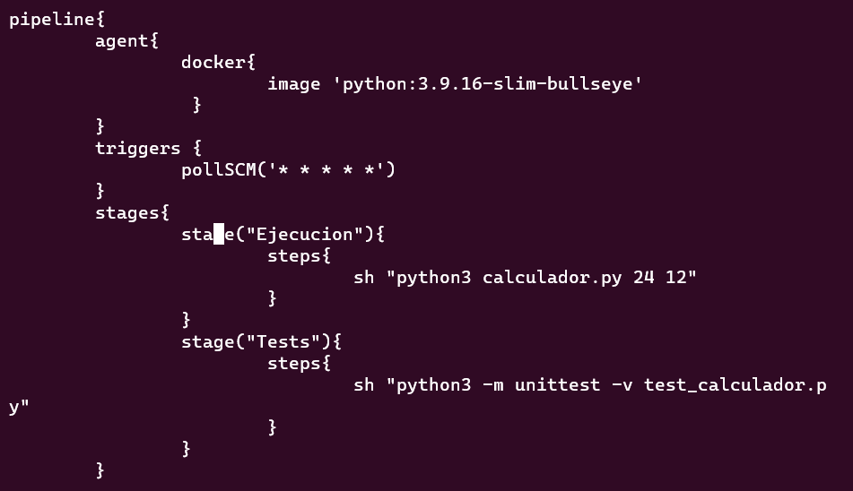
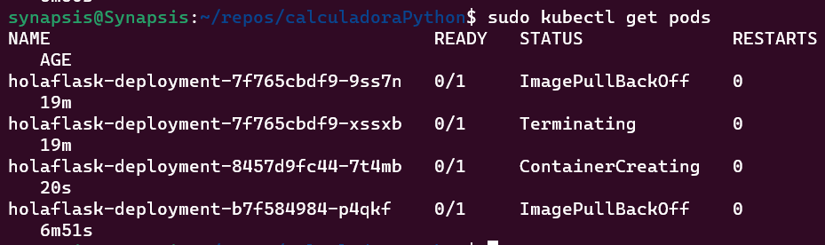

# Examen final

Responde con las soluciones y los requerimientos de estas soluciones de las siguientes preguntas
relacionadas a microservicios

1. (1 punto)¿Cómo pueden los clientes encontrar microservicios y sus instancias?
    A las instancias de microservicios normalmente se les asignan direcciones IP dinámicas cuando se inician, por ejemplo, cuando se ejecutan en contenedores. Esto dificulta que un cliente realice una solicitud a un microservicio que, por ejemplo, expone una API REST a través de HTTP. Considera el siguiente diagrama:

  Generalmente para ello se utilizan kubernetes ya que dispone de un DNS que permite descubrir una instancia directamente por su nombre. Pero de no darse el caso, el microservicio usara el DNS del sistema operativo para resolver direcciones y asi evitar que el cliente tenga que hacerlo.

2. (2 puntos) En un entorno de sistema de microservicios, en muchos casos es deseable exponer algunos de los microservicios al exterior del entorno del sistema y ocultar los microservicios restantes del acceso externo. Los microservicios expuestos deben estar protegidos contra solicitudes de clientes malintencionados.

  Para este fin, un balanceador de carga ayudaría, ya que serviría de puente a las solicitudes entrantes, redireccionando unicamente a aquellos servicios que deseamos exponer, y ocultando su acceso a los mismos.

3. (2 puntos) Tradicionalmente, como desarrolladores de Java, estamos acostumbrados a implementar la comunicación sincrónica mediante el bloqueo de E/S, por ejemplo, una API RESTful JSON sobre HTTP. El uso de una E/S de bloqueo significa que se asigna un subproceso desde el sistema operativo durante la duración de la solicitud. Si aumentas la cantidad de solicitudes simultáneas, un servidor podría quedarse sin subprocesos disponibles en el sistema operativo, lo que provocaría problemas que van desde tiempos de respuesta más prolongados hasta fallas en los servidores. El uso de una arquitectura de microservicios suele empeorar aún más este problema, donde normalmente se utiliza una cadena de microservicios cooperativos para atender una solicitud. Cuantos más microservicios participen en la atención de una solicitud, más rápido se agotarán los subprocesos disponibles.

  Se puede utilizar la arquitectura REST con RESTful APIs ya que estos utilizan el protocolo HTTP y estan mejor optimizados para comunicaciones cliente-servidor.

4. (2 puntos) Tradicionalmente, una aplicación se implementa junto con su configuración, por ejemplo, un conjunto de variables de entorno y/o archivos que contienen información de configuración. Ante un panorama de sistemas basado en una arquitectura de microservicios, es decir, con una gran  cantidad de instancias de microservicios desplegadas, surgen algunas dudas:

  * ¿Cómo obtengo una imagen completa de la configuración que existe para todas las instancias de microservicio en ejecución?

    Para evitar la configuración manual de cada aplicación, se realiza un Dockerfile, el cual contiene sus variables de entorno, archivos, he información de configuración en un solo archivo de texto que será instanciado muchas veces por herramientas como kubernets. 

    Junto a ello entran las configuraciones de los YAML que seran pasados a kubectl para que apliquen estas configuraciones a todas las instancias.

  * ¿Cómo actualizar la configuración y me aseguro de que todas las instancias de microservicio afectadas se actualicen correctamente?

    Se actualiza con el `kubectl apply` seguido del YAML con las actualizaciones, que seran aplicadas reiniciando los servicios en ejecución secuencialmente.

5. (3 puntos) Tradicionalmente, una aplicación escribe eventos logs en archivos logs que se almacenan en el sistema de archivos local del servidor en el que se ejecuta la aplicación. Dado un panorama de sistema basado en una arquitectura de microservicios, es decir, con una gran cantidad de instancias de microservicios implementadas en una gran cantidad de servidores más pequeños, podemos hacernos las siguientes preguntas:

  * ¿Cómo se obtiene una descripción general de lo que sucede en el entorno del sistema cuando cada instancia de microservicio escribe en su propio archivo log local?

    Dado que se necesita disponer de los logs de cada microservicio, se puede añadir en el Dockerfile de los docker la configuración para montar un Docker Volume que sea la base de datos general del sistema, de manera que no sea necesario acceder a los logs de cada microservicio, ya que cada todos lo guardaran en un solo lugar accesible para revisiones generales.

    Otra opcion seria que los microservicios realizen test periodicos automaticamente, de manera que envien logs al Docker Volume solo cuando los test empiezen a fallar, para evitar un flujo de datos innesesario.

  * ¿Cómo averiguo si alguna de las instancias de microservicio tiene problemas y comienza a escribir mensajes de error en sus archivos logs?

    Basandose en la solución anterior, habría que establecer un trigguer que verifique periódicamente esta base de datos de logs global por si algún microservicio hubiera enviado loggs de error.

  * Si los usuarios finales comienzan a informar problemas,¿cómo puedo encontrar mensajes logs relacionados? es decir,¿cómo puedo identificar qué instancia de microservicio es la causa raíz del problema? 

    Si los usuarios reportan problemas, y no tuvieramos logs enviados por algún microservicio entonces es muy probable que ese error sea muy reciente ya que el test periodico de cada microservicio no lo detectó aun. Por lo que habria que recrear el mismo contexto que llevo al fallo para que sea detectado por los test, y asi visualizarlo desde los logs globales.

6. (3 puntos) Debe ser posible rastrear solicitudes y mensajes que fluyen entre microservicios mientras se procesa una solicitud externa al entorno del sistema. Algunos ejemplos de escenarios de falla son los siguientes:

* Si los usuarios finales comienzan a presentar casos de soporte con respecto a una falla específica,¿cómo podemos identificar el microservicio que causó el problema, es decir, la causa raíz?

  Bajo la suposición mencionada, seria posible buscar el los logs, la solicitud inicial que desencadeno el error.

* Si un caso de soporte menciona problemas relacionados con una entidad específica, por ejemplo, un número de pedido específico,¿cómo podemos encontrar mensajes de registro relacionados con el procesamiento de este pedido específico, por ejemplo, mensajes logs de todos los microservicios que estuvieron involucrados en su
  procesamiento?

  Para ello, lo más adecuado seria lanzar un bash a todos los microservicios para que busquen en los logs los registros relacionados al número de pedido especifico y lo guarden en el Docker Volume, y asi tenerlos a la mano todo junto para su analisis.

* Si los usuarios finales comienzan a presentar casos de soporte relacionados con un tiempo de respuesta inaceptablemente largo,¿cómo podemos identificar qué microservicio en una cadena de llamadas está causando la demora?

  Se podria recrear la solicitud hecha por el usuario, y luego buscar en los logs de los servicios la ruta de servicios que fueron usados para su llamada, y asi determinar por los tiempos de duración cual esta causando esa demora en el tiempo de respuesta.

## Parte 2

1. (0.5 puntos ) Ejecuta CouchDB como un contenedor de Docker y publica su puerto, de la siguiente manera:
    a. Ejecuta el contenedor.
    b. Publica el puerto de CouchDB.

  

  c. Abre el navegador y verifica que CouchDB esté disponible.

  

2. (1 punto) Crea una imagen de Docker con un servicio REST, respondiendo Hola Amigos CC-3S2 a
    localhost:8080/hola. Utiliza el lenguaje y el framework que prefieras. Estos son los pasos que
    debe seguir:
    a. Crea una aplicación de servicio web.

  

  b. Crea un Dockerfile para instalar dependencias y librerías. 

 

 c. Construye la imagen.

  d. Ejecuta el contenedor que publica el puerto.

  e. Verifica que se esté ejecutando correctamente utilizando el navegador (o curl).

  La forma más fácil de crear un servicio REST es usar Python con Flask
  (https://flask.palletsprojects.com/). Ten en cuenta que muchos frameworks web, de forma predeterminada, inician una aplicación solo en la interfaz localhost. Para publicar un puerto, es necesario iniciarlo en todas las interfaces ( app.run(host='0.0.0.0') en el caso de Flask).

3. (1 punto) Crea un master de Jenkins y imágenes de agentes Docker y úsalos para ejecutar una infraestructura de Jenkins capaz de crear proyectos de Ruby:
       a. Crea el Dockerfile del master de Jenkins, que instala automáticamente el complemento de Docker.

     Luego de realizar multiples intentos, inclusive siguiendo la documentacion encontrada, se configuro docker en jenkins manualmente. Aqui se presentan los intentos:

     

     

     

     

     

       b. Crea la imagen master y ejecuta la instancia de Jenkins.
       c. Crea el Dockerfile del agente (adecuado para el aprovisionamiento dinámico del agente), que instala el intérprete de Ruby.

     

       d. Crea la imagen del agente.

       e. Cambia la configuración en la instancia de Jenkins para usar la imagen del agente.

     

4. (1 punto) Crea un pipeline que ejecuta un script de Ruby que imprima Hola Mundo desde Ruby:

     Link del repositorio creado y usado:

     https://github.com/PAlejandroQ/jenkinsRuby

5. a. Crea un nuevo pipeline.

     

     b. Utiliza el siguiente comando de shell para crear el script hola.rb sobre la marcha:
       sh "echo \"puts 'Hola Mundo en Ruby'\" > hola.rb"
       c. Agregue el comando para ejecutar hola.rb , utilizando el intérprete de Ruby.

     

     ​	d. Ejecuta la construcción y observa la salida de la consola.

     

     

     5. (1 punto) Crea un programa de Python que multiplique, sume, reste, divida dos números pasados como parámetros de línea de comandos. Agrega pruebas unitarias y publica el proyecto
       en GitHub:

       Link del repositorio creado y usado:

       https://github.com/PAlejandroQ/calculadoraPython

       a. Crea dos archivos:calculador.py y test_calculador.py.

       

       b. Puedes usar la biblioteca unittest en https://docs.python.org/3/library/unittest.html.

       

       c. Ejecuta el programa y la prueba unitaria.

       

       

       

5. (1 punto) Crea el pipeline de integración continua para el proyecto de calculadora de Python:
  a. Usa Jenkinsfile para especificar el pipeline.

  

  b. Configura el trigger para que el pipeline se ejecute automáticamente en caso de que se haga commit en el repositorio. (hecho previamente)
  c. El pipeline no necesita el paso Compile ya que Python es un lenguaje interpretable.
  d. Ejecuta el pipeline y observa los resultados.

  

  e. Intenta hacer commit el código que rompe la construcción del pipeline y observa cómo se visualiza en Jenkins.

6. (0.5 puntos) Ejecuta una aplicación Hola Amigos CC-3S2 en el clúster de Kubernetes:
  a. La aplicación Hola Amigos CC-3S2 puede verse exactamente igualmente al ejercicio 2

  

  b. Implementa la aplicación con tres réplicas.

  

  

  c. Exponga la aplicación con el servicio NodePort.

  

  

