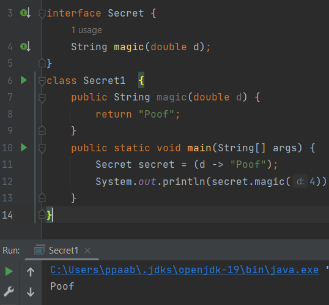
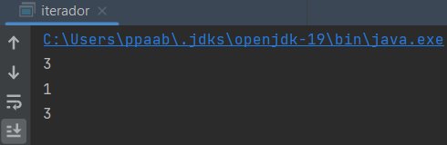
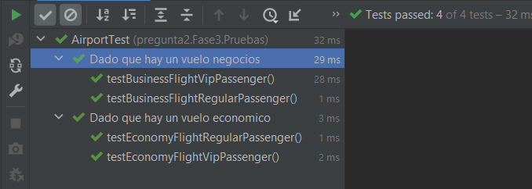

# Examen parcial de Desarrollo de software

## Pregunta 1

### ¿Cuál es el resultado de la siguiente clase?

```java
package pregunta1;
import java.util.function.Predicate;
public class Panda {
    int age;
    public static void main(String[] args) {
        Panda p1 = new Panda();
        p1.age = 1;
        check(p1, p -> p.age < 5);
    }
    private static void check(Panda panda,
                              Predicate<Panda> pred) {
        String result = pred.test(panda) ? "match" : "not match";
        System.out.print(result);
    }
}
```

La clase manda define un método `check` el cual recibe por parámetros un objeto `Panda` y un `Predicate` que recibirá un objeto `Panda` también. Este método evaluará la función lambda que se pasará como parámetro `pred`, mediante el llamado a su método `.test()` recibiendo el objeto de su primer parámetro. En base a si es verdadero o falso, la variable `result` guardara `"match"` o `"not match"` respectivamente.

Finalmente en la función `main` se instancia la clase `Panda`, se coloca el valor de $1$ en si atributo `age` y se pasa al método `check` este objeto junto a la expresión landa `p->p.age<5` . Por tanto el resultado es `match`.


### ¿Cuál es el resultado del siguiente código?

```java
package pregunta1;

interface Climb {
    boolean isTooHigh(int height, int limit);
}

public class Climber {
    public static void main(String[] args) {
//        check((h, m) -> h.append(m).isEmpty(), 5);
        check((h, m) -> h > m, 5);
    }

    private static void check(Climb climb, int height) {
        if (climb.isTooHigh(height, 10))
            System.out.println("too high");

        else
            System.out.println("ok");
    }
}
```

El código tal cual estaba, presenta un error en la línea que indica,

```java
check((h, m) -> h.append(m).isEmpty(), 5);
```

dado que la interfaz indica que el método `.isTooHigh()` debe recibir dos parámetros del tipo `integer` pero al momento de implementarlo con una función lambda desde la línea mencionada anteriormente, se observa que se trata de acceder al método de `append()`, el cual no pertenece al tipo `integer`. Por ello, la corrección seria cambiar esa línea por la siguiente:

```java
check((h, m) -> h > m, 5);
```

Dando por resultado `"ok"`:


### ¿Qué lambda puede reemplazar la clase Secret1 para devolver el mismo valor?

```java
package pregunta1;
interface Secret {
    String magic(double d);
}
class Secret1 implements Secret {
    public String magic(double d) {
        return "Poof";
    }
}
```

Puede ser reemplazado por el lambda `(d -> "Proof")`:



> Se puede observar que en la línea 6, ya no esta implementando la interfaz con el `implements`, sino que es la función lambda quien lo hace.

### Completa sin causar un error de compilación

```java
package pregunta1;
import java.util.ArrayList;
import java.util.List;
public class ClassRemove {
    public void remove(List<Character> chars) {
        char end = 'z';
        chars.removeIf(c -> {
            char start = 'a';
            return start <= c && c <= end;
        });
        System.out.println(chars.toString());
    }

    public static void main(String[] args) {
        String string = "abcdefgz1234";
        List<Character> lista = new ArrayList<Character>();
        for (char ct : string.toCharArray()) {
            lista.add(ct);
        }
        System.out.println(lista.toString());
        ClassRemove classRemove = new ClassRemove();
        classRemove.remove(lista);
    }
}

```

El código ya fue completado para que sea funcional, el cual elimina los caracteres de una cadena que sean letras minusculas de la "a" a la "z":


### ¿Qué puedes decir del siguiente código?

```java
package pregunta1;
import java.util.function.Supplier;
public class iterador {
    public static void main(String[] args) {
        int length = 3;
        for(int i = 0; i<3; i++) {
            if (i%2 == 0) {
                Supplier<Integer> supplier = () -> length; // A
                System.out.println(supplier.get()); // B
            } else {
                int j = i;
                Supplier<Integer> supplier = () -> j; // C
                System.out.println(supplier.get()); // D
            }
        }
    }
}
```

El siguiente código itera desde 0 hasta 2 con condiciones, si es múltiplo de 2, crea una interfaz funcional con `Supplier` que almacene un `integer`, el cual es implementado por la función lambda `()) -> length` , para luego imprimir 3, por su método `get()`. De no cumplirse esta condición, mostrará el valor de `j` en ese momento. Por tanto, el código imprime:  



### ¿Qué puedes decir del siguiente código?

```java
package pregunta1;
import java.util.ArrayList;
import java.util.List;
public class remove2 {
    public static void main(String[] args) {
        String string = "1a1d5g6a4ge7t8b";
        List<Character> lista = new ArrayList<Character>();
        for (char ct : string.toCharArray()) {
            lista.add(ct);
        }
        System.out.println(lista.toString());
        remove2 classRemove = new remove2();
        classRemove.remove(lista);
    }
    public void remove(List<Character> chars) {
        char end = 'z';
        chars.removeIf(c -> {
            char start = 'a';
            return start <= c && c <= end;
        });
    }
}
```

El presente ejemplo es semejante al de dos ejercicios atrás, mencionando que al momento de llamar al método de `removeIf` se esta usando una lambda que verifica esta condición de ser letras minúsculas.


## Pregunta 2

### Pregunta 1 (0.5 puntos): Ejecuta el programa y presenta los resultados y explica qué sucede.


* La función `main` de la clase `Airport` primero instancia los objetos `economyFlight`  y `businnesFlight` pasando los parámetros respectivos a su constructor. 
* Posteriormente instancia también dos objetos `pasajero` con los nombres `cesar` y `jesica`, dentro de los cuales `cesar` esta como VIP. 
* Luego añade ambos pasajeros al vuelo `businesFlight` y el `economyFlight`, además de retirarlos. Con esto busca testear manualmente lo siguiente:
  * Que se hayan creado correctamente.
  * Que se puedan añadir y solo borrar los pasajeros no VIP.
  * Que no se puedan añadir pasajeros no VIP a vuelos de negocios.
* Finalmente muestra las listas de pasajeros de cada vuelo iterativamente, verificando que efectivamente la lógica comercial se esta cumpliendo.

### Pregunta 2 (1 punto) Si ejecutamos las pruebas con cobertura desde IntelliJ IDEA,¿cuales son los resultados que se muestran?,¿Por qué crees que la cobertura del código no es del 100%?.


La cobertura de código muestra estos resultados por las siguientes razones:

* Existen 3 clases en el código de producción(Airport, Flight, Passenger), y 2 fueron usadas en los test, ya que la clase `Airport` tiene la función `main` , la cual no se esta testeando. Por ello aparece en 0% en esa clase.
* Existen 10 métodos en el código de producción, de los cuales 8 fueron cubiertos por alguna prueba.
* No todas las líneas fueron cubierta por los test. por ejemplo el lanzamiento de las excepciones no fue testeado. Por ello es que la cobertura no es del 100%.

Por estas razones es que el Test con cobertura entrego estos resultados.

### Pregunta 3 (0.5 punto)¿ Por qué John tiene la necesidad de refactorizar la aplicación?.

Porque el software tiene problemas en su estructura, lo cual hace que no sea escalable, y que cualquier cambio futuro requiera modificar cosas ya funcionales, forzando a testear y recompilar innecesariamente.

### Pregunta 4 (0.5 puntos): Revisa la Fase 2 de la evaluación y realiza la ejecución del programa y analiza los resultados.


Para la ejecución del problema, se utilizo la clase `Airport` de la fase 1 pero con las modificaciones respectivas para el uso de polimorfismos tal como se aprecia en la imagen. Como la ejecución muestra, toda la funcionalidad se mantiene correcta, y además, los test pasan como se esperaría:


### Pregunta 5 (3 puntos) La refactorización y los cambios de la API se propagan a las pruebas. Reescribe el archivo Airport Test de la carpeta Fase 3.

[código en IntelliJ: ExamenParcialCode/src/main/java/pregunta2/Fase3/Pruebas/AirportTest]

* ¿Cuál es la cobertura del código ?

  

  La cobertura que se muestra es del 100%.

* ¿ La refactorización de la aplicación TDD ayudó tanto a mejorar la calidad del código?

  Si, la refactorización permitió evitar tener que depender de un `if` para los tipos de vuelo, separándolo en 2 subclases, y así haciendo escalable el software.
  
  

### Pregunta 6 (0.5 puntos):¿En qué consiste está regla relacionada a la refactorización?. Evita utilizar y copiar respuestas de internet. Explica como se relaciona al problema dado en la evaluación.

Esta regla consiste en contar "Strikes" semejante al baseball. Cada vez que veamos que un código se repite, contar un strike. Si esto lleva a 3 "Strikes", entonces es necesario refactorizar.

Esto se relaciona con el problema de la evaluación, en que el método para añadir pasajeros tenia código duplicado dentro de los casos del `swith` para variar el comportamiento del método. En las lineas 54,39 junto a las 32 y 35 vemos estos casos, sumando más de 3 "Strikes".

### Pregunta 7 (1 punto): Escribe el diseño inicial de la clase llamada PremiumFlight y agrega a la Fase 4 en la carpeta producción.

Se crearon las firmas de los métodos a implementar, y una implementación básica que permite que estos métodos sean usados por los test. Acorde a la secuencia de desarrollo del TDD:

```java
class PremiumFlight extends Flight {
    // Formateado con Ctrl+Shift+Alt+l
    public PremiumFlight(String id) {
        super(id);
    }

    @Override
    public boolean addPassenger(Passenger passenger) {
        return false;
    }

    @Override
    public boolean removePassenger(Passenger passenger) {
        return false;
    }

}
```

### Pregunta 8 (2 puntos): Ayuda a John e implementa las pruebas de acuerdo con la lógica comercial de vuelos premium de las figuras anteriores. Adjunta tu código en la parte que se indica en el código de la Fase 4. Después de escribir las pruebas, John las ejecuta.

Primero se colocan las etiquetas que se mostrarán al ejecutar las pruebas. 

* Luego se crean los objetos necesarios para las pruebas.
* Después se instancian dichos objetos dentro del `setUp()` , el cual se ejecutará una vez para cada prueba para así evitar interferencias entre las mismas.
* Luego se inicia a colocar las pruebas anidadas ya que resultan semejantes. Dichas pruebas incluyen funciones lambda para validaciones de multiples asserts.
* Se valido para los casos de ambos pasajeros, y para acciones de añadir, y eliminar pasajeros en distintos tipos de vuelos detalladas en la parte inferior.

```java
    @DisplayName("Dado que hay un vuelo premium")
    @Nested
    class PremiumFlightTest {
        private Flight premiumFlight;
        private Passenger jessica;
        private Passenger cesar;

        @BeforeEach
        void setUp() {
            premiumFlight = new PremiumFlight("3");
            jessica = new Passenger("Jessica", false);
            cesar = new Passenger("Cesar", true);
        }

        @Nested
        @DisplayName("Cuando tenemos un pasajero regular")
        class RegularPassenger {

            @Test
            @DisplayName("Entonces no puede agregarlo o eliminarlo de un vuelo de premium")
            public void testBusinessFlightRegularPassenger() {
                assertAll("Verifica todas las condiciones para un pasajero regular y un vuelo de premium",
                        () -> assertEquals(false, premiumFlight.addPassenger(jessica)),
                        () -> assertEquals(0, premiumFlight.getPassengersList().size()),
                        () -> assertEquals(false, premiumFlight.removePassenger(jessica)),
                        () -> assertEquals(0, premiumFlight.getPassengersList().size())
                );
            }
        }

        @Nested
        @DisplayName("Cuando tenemos un pasajero VIP")
        class VipPassenger {

            @Test
            @DisplayName("Luego puedes agregarlo y puedes eliminarlo de un vuelo premium")
            public void testBusinessFlightVipPassenger() {
                assertAll("Verifica todas las condiciones para un pasajero VIP y un vuelo de negocios",
                        () -> assertEquals(true, premiumFlight.addPassenger(cesar)),
                        () -> assertEquals(1, premiumFlight.getPassengersList().size()),
                        () -> assertEquals(true, premiumFlight.removePassenger(cesar)),
                        () -> assertEquals(0, premiumFlight.getPassengersList().size())
                );
            }
        }
    }
```


> El resultado que la prueba fallara es el esperado, ya que aun en la siguiente fase se implementara la lógica comercial del nuevo tipo de vuelo.

### Pregunta 9 (2 puntos): Agrega la lógica comercial solo para pasajeros VIP en la clase PremiumFlight. Guarda ese archivo en la carpeta Producción de la Fase 5.

```java
package pregunta2.Fase5.Produccion;
public class PremiumFlight extends Flight {

    public PremiumFlight(String id) {
        super(id);
    }

    @Override
    public boolean addPassenger(Passenger passenger) {
        if (passenger.isVip()) {
            return passengers.add(passenger);
        }
        return false;
    }

    @Override
    public boolean removePassenger(Passenger passenger) {
        return passengers.remove(passenger);
    }

    // Diseño de la lógica comercial para los pasajeros VIP.Pregunta 9
}
```


### Pregunta 10 (1 punto) Ayuda a John a crear una nueva prueba para verificar que un pasajero solo se puede agregar una vez a un vuelo de manera que John ha implementado esta nueva característica en estilo TDD.

```java
// Test para pasajero regular
//{...} más lineas de codigo
@DisplayName("Entonces no puedes agregarlo a un vuelo economico mas de una vez")
            @RepeatedTest(5)
            public void testEconomyFlightRegularPassengerAddedOnlyOnce(RepetitionInfo repetitionInfo) {
                for (int i = 0; i < repetitionInfo.getCurrentRepetition(); i++) {
                    economyFlight.addPassenger(cesar);
                }
                assertAll("Verifica que un pasajero regular se pueda agregar a un vuelo económico solo una vez",
                        () -> assertEquals(1, economyFlight.getPassengersSet().size()),
                        () -> assertTrue(economyFlight.getPassengersSet().contains(cesar)),
                        () -> assertTrue(new ArrayList<>(economyFlight.getPassengersSet()).get(0).getName().equals("Cesar"))
                );
            }
//{...} más código
// Test para VIP
public void testBusinessFlightVipPassengerAddedOnlyOnce(RepetitionInfo repetitionInfo) {
                for (int i = 0; i < repetitionInfo.getCurrentRepetition(); i++) {
                    businessFlight.addPassenger(cesar);
                }
                assertAll("Verifica que un pasajero VIP se pueda agregar a un vuelo de negocios solo una vez",
                        () -> assertEquals(1, businessFlight.getPassengersSet().size()),
                        () -> assertTrue(businessFlight.getPassengersSet().contains(cesar)),
                        () -> assertTrue(new ArrayList<>(businessFlight.getPassengersSet()).get(0).getName().equals("Cesar"))
                );
            }
```


## Pregunta 3 (5 puntos)

### Pregunta 1 (0.5 puntos) :¿Cuales son los problemas de este código de prueba?.

```java
class InvoiceTest {    
    @Test
    void test1() {
        Invoice invoice = new Invoice(new BigDecimal("2500").doubleValue(),"NL",
                CustomerType.COMPANY);
        double v = invoice.calculate();
        assertThat(v).isEqualTo(250);
    }
}
```

Pese a que la prueba tiene razón de existir(evalúa un método), no tiene aseveraciones sólidas, pues pese a que la prueba pasa con una modificación, es muy ambigua y no asegura que realmente funcione lo que testea. Por ejemplo:

* El tipo de parámetro que entrega al constructor es incorrecto, ya que este espera  un dato de tipo `double` , pero un objeto `BigDecimal` esta siendo pasado. Esto significa que realmente no se esta testeando en las condiciones que se debería. 
* También el parámetro de `CustomerType` tiene ambigüedad, dado que en vez de pasar un objeto de ese tipo, esta pasando un atributo del mismo que pese a que pueda ser del mismo tipo, NO esta asegurando un comportamiento solido desde el principio. 
* Supongamos que la clase `CustomerType` cambie en su comportamiento; pero como el parámetro esta haciendo referencia a solo un atributo de la clase, entonces es posible que el test siga pasando. Esto va en contra de la característica que si el comportamiento cambia, los test deben fallar.
* Puede fallar de muchas maneras y no una clara. Podría fallar por un problema en los parámetros ambiguos, y sin embargo mostrar que fallo la prueba para `calculate ` pese a que esta funcione.

### Pregunta 2 (1 punto) : Escribe una versión más legible de este código prueba. Recuerda llamarlo InvoiceTest.java

En esta versión, se esta inicializando un valor double de 2500, "NL", y 

```java
public class InvoiceTest {
   @Test
    void test1() {
        Invoice invoice = new Invoice(2500,"NL",
                CustomerType.COMPANY);
        double v = invoice.calculate();
        assertThat(v).isEqualTo(250);
    }
}
```


### Pregunta 3 (1 punto) : Implementa InvoiceBuilder.java. Siéntete libre de personalizar sus constructores. Un truco común es hacer que el constructor construya una versión común de la clase sin requerir la llamada a todos los métodos de configuración.

El constructor diseñado inicializa valores por defecto en el constructor. Tales son "NL", PERSON y 500 para los valores de `country`, `customerType` y `value` respectivamente. De esta manera se puede instanciar el objeto sin inicializar los datos.

```java
package pregunta3;
public class InvoiceBuilder {
    private String country ;
    private CustomerType customerType;
    private double value;
    public InvoiceBuilder(){
        country = "NL";
        customerType = CustomerType.PERSON;
        value = 500;
    }
    public InvoiceBuilder withCountry(String country) {
        this.country = country;
        return this;
    }
    public InvoiceBuilder asCompany() {
        this.customerType = CustomerType.COMPANY;
        return this;
    }
    public InvoiceBuilder withAValueOf(double value) {
        this.value = value;
        return this;
    }
    public Invoice build() {
        return new Invoice(value, country, customerType);
    }
}
```

### Pregunta 4 (0.5 puntos) : Escribe en una línea una factura compleja. Muestra los resultados

Luego de instanciar `invoiceBuilder`, se lo configura como una compañía, se le asigna un país, se le asigna un valor, y luego se usa el método `build` para para instanciar un nuevo objeto con estas nuevas características.

Creación de una factura en una línea:

```java
invoiceBuilder.asCompany().withCountry("PE").withAValueOf(120).build();
```

Código completo de la función `main`:

```java
package pregunta3;
public class Main {
    public static void main(String[] args) {
        InvoiceBuilder invoiceBuilder = new InvoiceBuilder();
        Invoice invoice = invoiceBuilder.asCompany().withCountry("PE").withAValueOf(120).build();
        System.out.println("Value: " + invoice.getValue());
        System.out.println("Country: "+ invoice.getCountry());
        System.out.println("CustomerType: "+invoice.getCustomerType());
        System.out.println("Calculate: "+invoice.calculate());
    }
}
```


### Pregunta 5 (1 punto) : Agrega este listado en el código anterior y muestra los resultados

* El primer método agregado es `anyCompany()` , el cual pre-configura el `CustomerType` a COMPANY.
* El segundo método `fromTheUS()` pre-configura el atributo  `country`  a "US".

Se agregó nuevos objetos para mostrar el funcionamiento de los nuevos métodos. Aquí se crearon 3 objetos `invoiceBuilder` para que no haya interferencia en los resultados:

```java
		InvoiceBuilder invoiceBuilder1 = new InvoiceBuilder();
        Invoice invoice1 = invoiceBuilder1.anyCompany();
        System.out.println("Value: " + invoice1.getValue());
        System.out.println("Country: "+ invoice1.getCountry());
        System.out.println("CustomerType: "+invoice1.getCustomerType());
        System.out.println("Calculate: "+invoice1.calculate());
        System.out.println("-------------------------------");

        InvoiceBuilder invoiceBuilder2 = new InvoiceBuilder();
        Invoice invoice2 = invoiceBuilder2.fromTheUS();
        System.out.println("Value: " + invoice2.getValue());
        System.out.println("Country: "+ invoice2.getCountry());
        System.out.println("CustomerType: "+invoice2.getCustomerType());
        System.out.println("Calculate: "+invoice2.calculate());
        System.out.println("-------------------------------");
```


### Pregunta 6 (1 punto): Agrega este listado en el código anterior y muestra los resultados .

El código del test agregado crea dos variables double llamadas `invoiceValue` y `tax`. Con estos datos se configura un `InvoiceBuilder` como una compañía, del país "NL" y con el valor del `invoiceValue`.  Posteriormente de crea el objeto mediante el método `build` , y se utiliza este nuevo objeto para calcular el valor requerido. Finalmente se compara este valor con el valor que se esperara que fuera:


