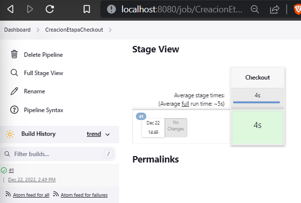

# Practica calificada 4

## Pregunta 1

* ¿Se necesita la infraestructura SOA para integrar los dos nuevos servicios?

  Si, ya que pese a que se necesitara una nueva implementación, esos servicios igual necesitaran de la infraestructura SOA. Esto se ve, en la Orchestration & Integration, el cual usara estos 2 nuevos servicios para trabajar en conjunto con los ya existentes.

* El servicio de evaluación de campañas necesita manejar una gran cantidad de datos.

  

* ¿Sería mejor utilizar la replicación de datos, la integración a nivel de interfaz de usuario o las
  llamadas de servicio para acceder a grandes cantidades de datos?

  Al tratarse de grandes cantidades de datos, la replicación no seria una buena opción, ya que se tendria más datos de los necesarios.En la integración a nivel de interfaz se busca ensamblar todo en un framework, pero para acceder a grandes datos, es mejor que cada servicio lo haga de manera independiente. Por ello seria mejor las llamadas de servicios.

* ¿Cuál de estas opciones de integración suele ofrecer SOA?

  Suele ofrecer:

  * Integracino de Web Service Provider
  * Integracino de Web service Consumer
  * Notificaciones de eventos.

* ¿Debe el servicio integrarse al portal existente o tener su propia interfaz de usuario?

  El servicio debe integrarse al existente, ya que cada vez que el portal lo necesite, accedera a este de manera semejante como se lo haría a una API.

* ¿Cuáles son los argumentos a favor de cada opción?

* ¿Deberías implementar la nueva funcionalidad, el equipo de CRM?

  Si, ya que respeta la estructura seguida de independencia de servicios.

## Pregunta 2

1. En un sistema basado en microservicios puede haber diferentes tipos de comunicación; sin embargo, debe haber un tipo de comunicación predominante.¿Cuál escogerías?¿Qué otros están permitidos además?¿En qué situaciones?

   RESTful Web API como predominante ya que permitiria una baja latencia, y de hecho, es el primero que se viene a la mente cuando alguien piensa enc comunicació de microservicios.

   Streaming integration, podria ser tambien porque permitiria una comunicacion asincronita usando un sistema de colas de mensajes, que a diferencia del Messaging integration, mantiene los mensajes aun luego de haber sido consumidos por los microservicos sirviendo tambien como un almacenamiento.

   Por otro lado, estan permitidos los de messagin Integration, los de RPC Integration y RESTful Web API.

   Los Streaming y Messagin integration son  especialmente para servicios que podrian tener muchas llamadas pero que no necesiten unar respuesta inmedita, por lo que un sistema de colas vendria bien.

2. ¿Utilizarías la replicación de datos en un sistema basado en microservicios?¿En qué áreas?¿Cómo lo implementarías?

## Pregunta 3 

## Pregunta 4

### Completa las actividades 21 y 22 del curso. Muestra cada uno de los pasos seguidos.

1. Un Hello World de varias etapas:

   

### Sintaxis del pipeline

### Checkout

### Creación de un proyecto Java Spring Boot

