# Práctica calificada 4

## Completar actividades 23 y 24:

### Actividad 23

#### Docker registry

Docker Registry funcionando con las credenciales.

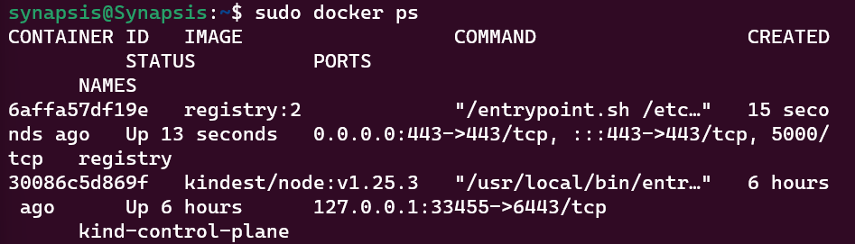

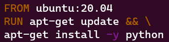

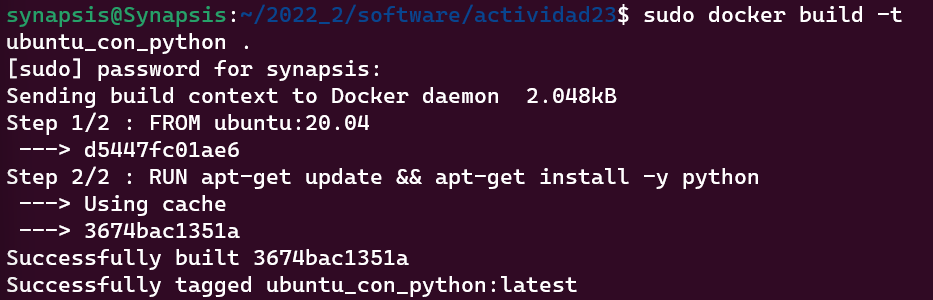

#### Docker Push

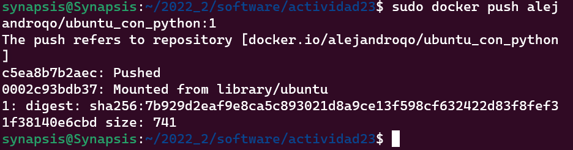

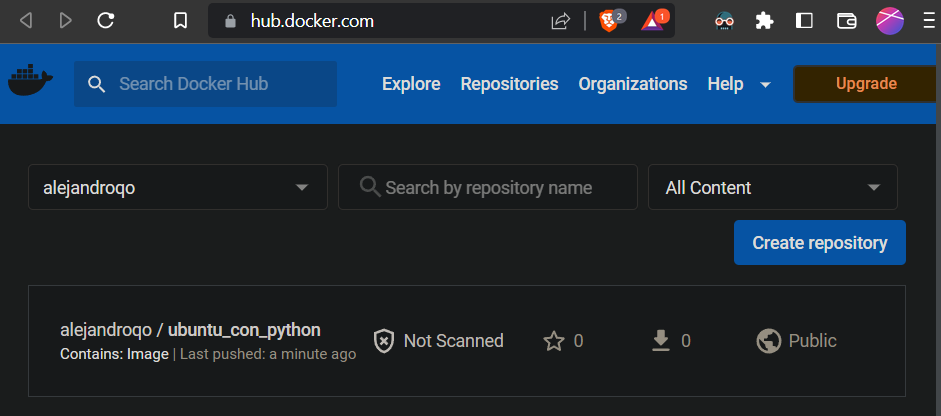

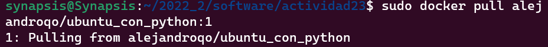

### Pruebas de aceptación en el pipeline de Jenkins

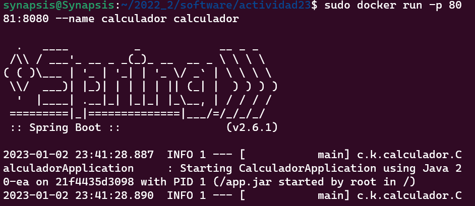

Añadiendo las nuevas etapas al pipeline en Jenkinsfile:

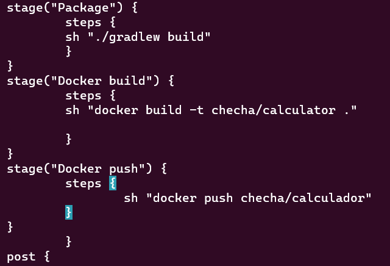

### Etapa de prueba de aceptacion

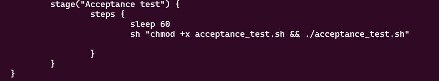

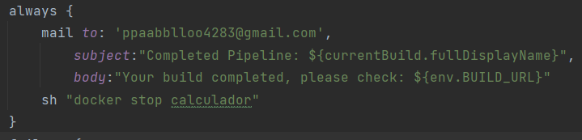

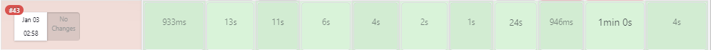

Creación de los criterios de aceptación:

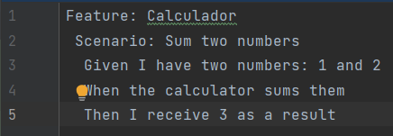

Creacion de enlaces para que la especificacion de caracteristicas sea ejecutable.

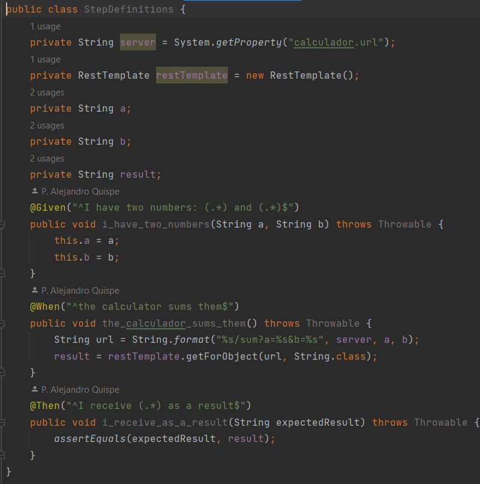

Configuraciones del gradle.build:

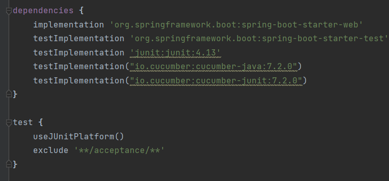

Verificación de funcionamiento:

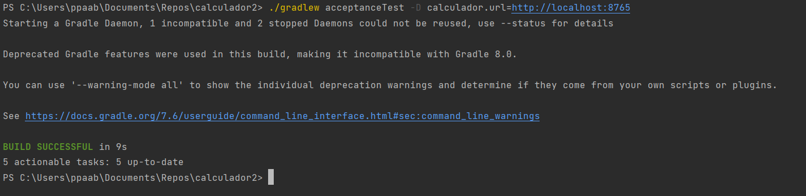

Luego de corregir unos problemas en el borrado de los docker creados, finalmente funcionó correctamente, y verificado que no vuelva a fallar.

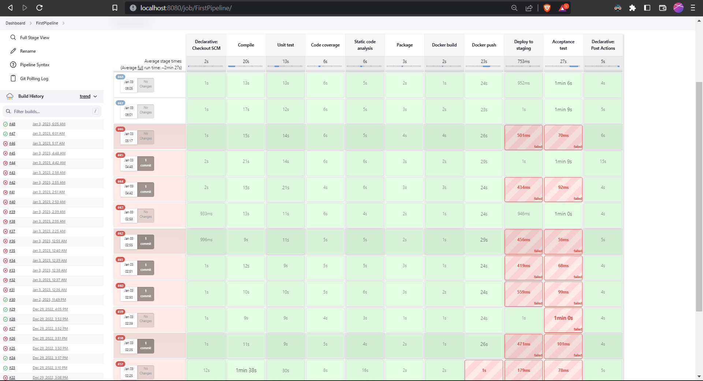
