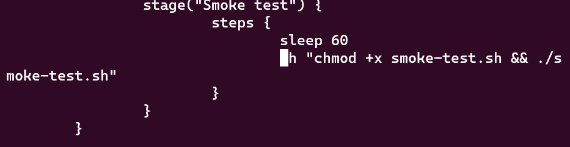

# Práctica calificada 4

Link del repositorio usado:

https://github.com/PAlejandroQ/calculador2

## Completar actividades 23 y 24:

### Actividad 23

#### Docker registry

Docker Registry funcionando con las credenciales.


#### Docker Push


### Pruebas de aceptación en el pipeline de Jenkins


Añadiendo las nuevas etapas al pipeline en Jenkinsfile:


### Etapa de prueba de aceptacion


Creación de los criterios de aceptación:


Creacion de enlaces para que la especificacion de caracteristicas sea ejecutable.


Configuraciones del gradle.build:


Verificación de funcionamiento:


Luego de corregir unos problemas en el borrado de los docker creados, finalmente funcionó correctamente, y verificado que no vuelva a fallar.


## Actividad 24

Verificación de la instalación de kubectl:


Creación y definición del archivo `.yaml`:


Verificación de las creacion de los tres Pods:


Verificar que se hayan creado los 3 Pods, cada uno con un contenedor Docker:


Verificar registros de un Pod con su contenedor:


Instalando el servicio equilibrador de carga del tráfico, verificación correcta del servicio, y que el servicio apunte a las 3 réplicas de Pod creadas anteriormente:


Accediendo al servicio desde afuera con NodePort, primero buscando la IP del nodo:


y posteriormente el puerto al que se esta redirigiendo el servicio:


para finalmente verificar que se puede acceder a Calculador desde el exterior:


### Kubernetes avanzado

#### Escalar una aplicación

Escalando la aplicación a 5 instancias:


Verificando la ampliación:


### Actualización de una aplicación


Aplicando la configuración y verificando que Kubernetes finalizó los Pods antiguos y comenzó los nuevos:


### Actualizaciónes continuas


Realizando limpieza:


### Dependencias de la aplicación

Resolucion DNS de kubernetes, y Hazelcast:


Verificacion de pods:


Verificacion de registros del Pod:


### Implementación del sistema multiaplicación


#### Borrando la prueba de contexto creada por Spring Boot


### Agregar almacenamiento en caché de Spring Boot


Creando el nuevo contenedor:


Subiendo el contenedor a dockerHub:


Aplicando la implementación con los `.yaml`:


Verificando que esta conectado al servidor Hazelcast desde los registros de Hazelcast:


y tambien desde los pods de Calculador:


## Pregunta 2

### Pregunta 1

Menciona diferentes enfoques para proporcionar a los agentes las credenciales del
servidor.

* Poner una llave SSH en el agente en el caso que no estemos usando un aprovisionamiento dinámico de dockers trabajadores.
* Poner una llave SSH en la imagen de agente si se usa aprovisionamiento dinamico de dockers trabajadores.
* Configurar las credenciales en Jenkins y que las use en el pipeline.
* Copiar dinamicamente la llave SSH en los trabajadores al iniciarse el constructor de Jenkins.

### Pregunta 2

Aprendimos mucho sobre los requisitos funcionales y las pruebas de aceptación
automatizadas. Pero,¿qué debemos hacer con los requisitos no funcionales? O aún más desafiante,¿qué pasa si no hay requisitos?¿Deberíamos omitirlos en el proceso de CD?

Los requisitos no funcionales pueden causar un riesgo significante en como el sistema opera. Si no hay requisitos, se los debe extraer en base a requerimientos que garantizen que el cliente este satisfecho aparte de que funcione bien.

No deben omitirse, incluso deben ser especificados en test de la misma manera que los requisitos de aceptación. Añadiendose una etapa al pipeline.

### Pregunta 3

¿Qué son las pruebas de rendimiento ?,¿qué es el (RTT, round-trip time) ?.

Las pruebas no funcionales más usadas,pues miden la estabilidad y el tiempo de respuesta del sistema. RTT es el tiempo que un paquete  de informacion demora en regresar a su emisor habiendo pasado por su lugar de destino esperado.

### Pregunta 4

¿Qué son las pruebas de carga?,¿en que ciclo del CD su uso es muy común?

Son pruebas orientadas a verificar el comportamiento del sistema ante una gran cantidad de solicitudes simultaneas. Su uso es común en la etapa de liberación.

### Pregunta 5

¿Qué son las pruebas de estrés?,¿estas pruebas son adecuadas para el proceso CD?

Son pruebas semejantes a las pruebas de carga, con la diferencia que se mantiene la latencia constante incrementando el rendimiento para saber el máximo numero de llamadas que puede soportar con un sistema aun operable. 

Esta prueba no es adecuada para el CD porque requiere largos test, por lo que debe preparado en scripts separados en Jenkins pipeline.

### Pregunta 6:

¿Qué son las pruebas de escalabilidad?,¿estas pruebas son fáciles de incluir en el pipeline de CD ?¿por qué?

Son pruebas que permiten explicar como es que el rendimiento y la latencia cambia cuando se añaden más servidores y servicios. Se espera un comportamiento lineal.

Estas pruebas deben ser automatizadas, pero de manera similar a los test de estrés, no deben ser puestas en el CD, sino separados.

### Pregunta 7

¿Qué es un Soak test o pruebas de resistencia o pruebas de longevidad ?,¿tiene sentido ejecutarlos dentro del pipeline CD?

Ejecuta el sistema por un largo periodo de tiempo para ver si el performance tiende a caer en ese periodo. Puede detectar fugas de memoria o problemas de estabilidad.

No tiene mucho sentido ponerlos dentro del CD, por lo que van aparte.

### Pregunta 8

¿De qué tratan las pruebas de seguridad?.¿Las pruebas de seguridad deben incluirse en el
proceso de CD como una etapa del pipeline?,¿como se utilizan en el framework (BDD)?

Tratan aspectos que son requerimientos puramente funcionales como las autorizaciones, autenticaciones y asignación de roles.

Deben ser incluidas en el proceso CD

### Pregunta 9

¿De qué trata las pruebas de mantenibilidad?

Buscan explicar que tan simple es el sistema de mantener por la calidad de su código. Sonar tool puede tambien dar una vista superficial acerca de la calidad de código en el análisis de código estático.

### Pregunta 10

¿ Qué son las pruebas de recuperación?¿Relaciona su uso con la herramienta Chaos Monkey ?

Es una técnica para determinar que tan rápido el sistema puede recuperarse despues de un crasheo por errores de software o hardware. 

La herramienta Chaos Monkey termina aleatoriamente instancias del entorno de produccion para forzar a los ingenieros a escribir código que haga al sistema resistente a fallos.


### Control de versiones de Jenkins

#### Uso de fecha y hora

Añadiendo las versiones con TIMESTAMP:


## Creando clusters


### Versionado


### El entorno de staging remoto


### El entorno de pruebas de aceptación


### Lanzamiento


### Prueba de humo



### Pregunta 11

Pasos realizados:

```groovy
pipeline {
	agent any
	triggers {
        	pollSCM('* * * * *')
		}
	stages {
		stage("Compile") {
			steps {
				sh "./gradlew compileJava"
			}
		}
		stage("Unit test") {
			steps {
				sh "./gradlew test"
			}
		}
		stage("Code coverage") {
		    steps {
			sh "./gradlew jacocoTestReport"
			publishHTML (target: [
			reportDir: 'build/reports/jacoco/test/html',
			reportFiles: 'index.html',
			reportName:"JaCoCo Report"
			])
			sh "./gradlew jacocoTestCoverageVerification"
		    }
        	}
		stage("Static code analysis") {
		    steps {
			sh "./gradlew checkstyleMain"
			publishHTML (target: [
			reportDir: 'build/reports/checkstyle/',
			reportFiles: 'main.html',
			reportName:"Checkstyle Report"
			])
		    }
		}
		stage("Package") {
			steps {
			sh "./gradlew build"
			}
		}
		stage("Docker build") {
			steps {
			sh "docker build -t alejandroqo/calculador:${BUILD_TIMESTAMP} ."

			}
		}
		stage("Docker push") {
			steps {
				sh "docker push alejandroqo/calculador:${BUILD_TIMESTAMP}"
			}
		}
		stage("Update version") {
               		steps {
                    		sh "sed  -i 's/{{VERSION}}/${BUILD_TIMESTAMP}/g' deployment.yaml"
               		}
          	}
		stage("Deploy to staging") {
			steps {
				//sh "docker run -d --rm -p 8765:8080 --name calculador alejandroqo/calculador:${BUILD_TIMESTAMP}
			sh "kubectl config use-context kind-staging"
			sh "kubectl apply -f hazelcast.yaml"
			sh "kubectl apply -f deployment.yaml"
			sh "kubectl apply -f service.yaml"
			}
		}
		stage("Acceptance test") {
			steps {
				sleep 60
				//sh "./gradlew acceptanceTest -D calculador.url=http://localhost:8765"
				sh "chmod +x acceptance-test.sh && ./acceptance-test.sh"

			}
		}
		stage("Release") {
               		steps {
                    		sh "kubectl config use-context kind-production"
                    		sh "kubectl apply -f hazelcast.yaml"
                    		sh "kubectl apply -f deployment.yaml"
				sh "kubectl apply -f service.yaml"
               		}
          	}
		stage("Smoke test") {
              		steps {
                  		sleep 60
                  		sh "chmod +x smoke-test.sh && ./smoke-test.sh"
              		}
          	}
	}
		
		post {
			always {
			    mail to: 'ppaabblloo4283@gmail.com',
			    	subject:"Completed Pipeline: ${currentBuild.fullDisplayName}",
			    	body:"Your build completed, please check: ${env.BUILD_URL}"
			    sh "docker stop calculador"
			}
			failure {
			    slackSend channel: '#sprint',
			    color: 'danger',
			    message:"The pipeline ${currentBuild.fullDisplayName} failed."
			}
		
		}
	}
```

Al principio, elige el agente donde ejecutará el pipeline, y como inicialmente configuramos para que el mismo Jenkins no ejecute ninguna tarea, entonces elegirá al agente que le añadimos.


* Posteriormente, activa el trigger que verificara cada minuto si hubo algun cambio en el repositorio. De detectar alguno, inicia automaticamente el pipeline.
* Luego se realiza la etapa de compilacion, de los test unitarios, se verifica la covertura de código con Jacoco.
* Despues se hace una verificacion de código estatico, aca Sonar tool pueden entrar en acción.
* Ahora que se tiene la compilación lista, se creara una imagen que contiene la construcción obtenida previamente.
* Esta imagen es subida al dockerHub con su respectiva etiqueta de versionado por tiempo.
* Se actualiza el valor de la version, y se inicia el dezpliegue en el cluster. kind-staging.
* Se inicia el cache con el hazelcast, el deployment y el servicio. 
* Luego que hayan pasado la prueba de aceptación, se lo despliega pero ya en el cluster de producción `kind-produccion`.
* Finalmente se realiza un testeo de humo unicamente para verificar que no haya alguna eventualidad adicional.


> Hubo problemas en el test de aceptacion pese a que si lee el puerto y la IP del nodoPort adecuadamente.


