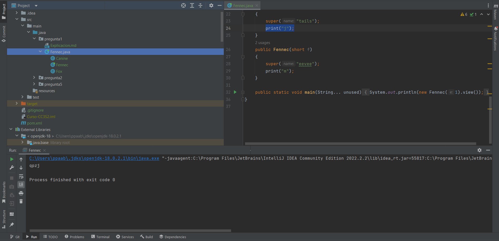

# Pregunta 1

## ¿Cuál es la salida del siguiente programa?

> La enumeración mencionada a continuación esta basada en el código presentado en el repositorio.

1. La función `main` de la linea 32 imprime en pantalla el resultado del metodo `.view()`  de la clase instanciada de ``Fennec(1)`` .
2. Como el parametro dado es de tipo `int`, se llama al constructor de este tipo, en la linea 21, `public Fennec(int e)`.
3. Este constructor llama en la linea 23 (`super("tails")`), a su super clase dando una variable de tipo `string` al constructor de la super clase `public Fox(String name)`.
4. Este constructor ejecuta en la linea 15 `this(2)` , lo cual llama al constructor `public Fox(long x)`, pero se sabe que la primera linea del constructor de una clase viene siempre con la instruccion `super()` por defecto a menos que se le especifique. 
5. Por lo que se llamara sin parametros al constructor(`public Canine()`, linea 4) de la super clase de `Fox`, el cual añadira el caracter **"q"** a la variable de tipo Stringbuilder llamada `logger`.
6. Luego se continua en donde se lo dejo al paso 4, el cual llama al método heredado de `Canine` llamado `print("p")` de la linea 7, el cual añadirá el caracter **"p"** a la variable `logger`, siendo ahora **"qp"**
7. Se regresa a la linea 16 continuando con el paso 4. Luego de llamar al `this(2)`, se llama al metodo `print("z")` que añadira este caracter a la variable `logger`, siendo ahora **"qpz"**
8. Finalmente retomamos en la linea 24 del paso 3, `print("j")`, donde añadiremos el caracter **"j"** a la variable `logger` siendo ahora **"qpzj"**.

 

