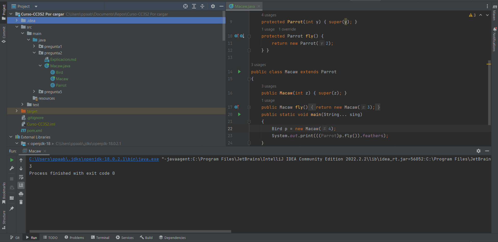

# Pregunta 2

## ¿Qué afirmación sobre el siguiente programa es correcta? Si encuentras un error (es) corrígelo y presenta una respuesta correcta del código

- Una línea contiene un error del compilador
- Dos líneas contienen errores del compilador
- Tres líneas contienen errores del compilador
- El código se compila pero lanza una ClassCastException en tiempo de ejecución
- e) El programa compila e imprime 3. 
- El programa compila e imprime 0.

La correcta es la letra **"e"**, *"el programa compila e imprime 3"*:

1. La función `main` instancia la clase `Macaw` en `p` como un objeto `Bird` dándole el valor de 4 al constructor de `Bird` por los sucesivos `super()` que contienen sus subclases.
2. Luego castea el objeto `Bird` a un objeto `Parrot`, para posteriormente llamar a su método `.fly()` el cual retorna un objeto `Parrot` al cual se le dio el valor de 3 a su constructor(linea 17) que asigna el valor de 3 a la variable `feathers`. 
3. Finalmente se llama al atributo `feathers` para mostrarlo en pantalla, el cual es de 3.

