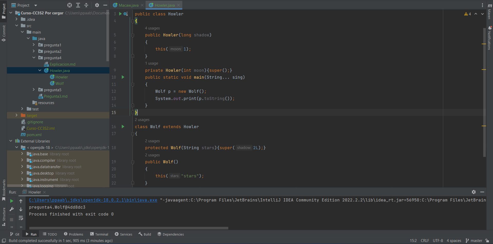

# Pregunta 4

## Completa los espacios en blanco que permiten que se compile el código

1. La clase `Wolf` tiene dos constructores, de los cuales uno esta _protegido_ mientras que el otro es *publico*, por lo que tenemos que hacer que el constructor publico llame al constructor protegido de la línea 13, usando `this("stars")` con el parámetro de una `string`  para que use ese constructor protegido.
2. Luego, este constructor llamara a su super clase ``Howler`` dándole un parámetro de tipo `long` el cual llamará al constructor publico de la línea 5 `public Howler(long shadow)` que recibe parámetros justo de este tipo.
3. Para finalmente añadirle `this(1)` que llamara al constructor privado de la línea 9, `private Howler(int moon)` y así llamar al constructor de la clase `Object`.

> Se añadió la función `main` para verificar que se este instanciando la clase correctamente.

