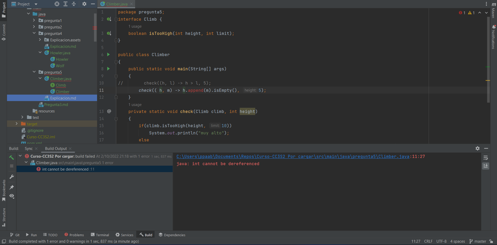

# Pregunta 5

## ¿Cuál es el resultado del siguiente código?

> Las numeraciones de línea son en base al código del repositorio.

Al compilar el código se obtiene el presente error:



1. Primero la función `main` llama a la función `check` de la línea 13, la cual recibe por parámetros a una interfaz de tipo `Climb` y una variable `int` con las que verificara una condición usando el método `isTooHigh(int height, int limit)` de la línea 3.

2. Luego, en la línea 11 se usa la expresión landa para implementar el funcionamiento del método `isTooHigh` en el parámetro de la función `check`, siendo aquí donde ocurre el error. Esto sucede por que la interfaz `Climb` especifica en la línea 3 que el método `isTooHigh` debe tener dos parámetros de tipo `int` , pero en la expresión landa (línea 11) se esta intentando usar el método `append()` y luego el método `isEmpty()`a una variable `int`, lo cual no es valido pues va en contra con lo especificado en su interfaz `Climb`.

3. Finalmente, para corregir este código modificaremos la línea de la siguiente manera:

   ```java
   // Colocamos esta linea
   check((h, m) -> h > m, 5);
   // en vez de esta linea
   check(( h, m) -> h.append(m).isEmpty(), 5);
   ```

   Resultando en que el código ya se encuentra completamente funcional:

   